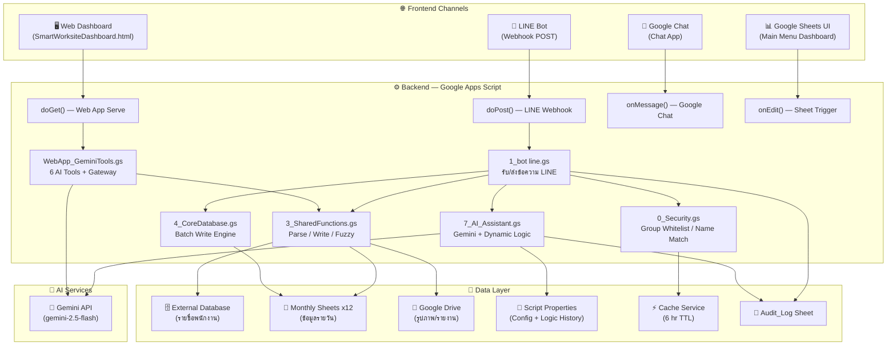
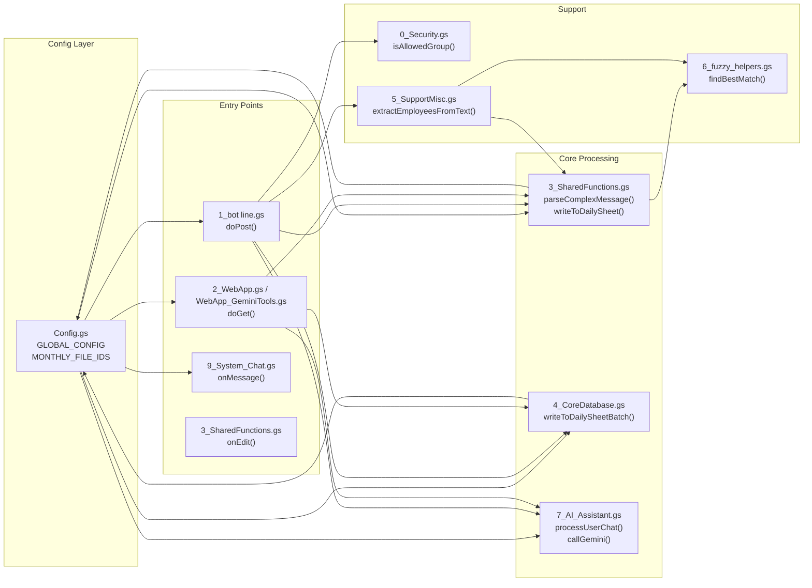
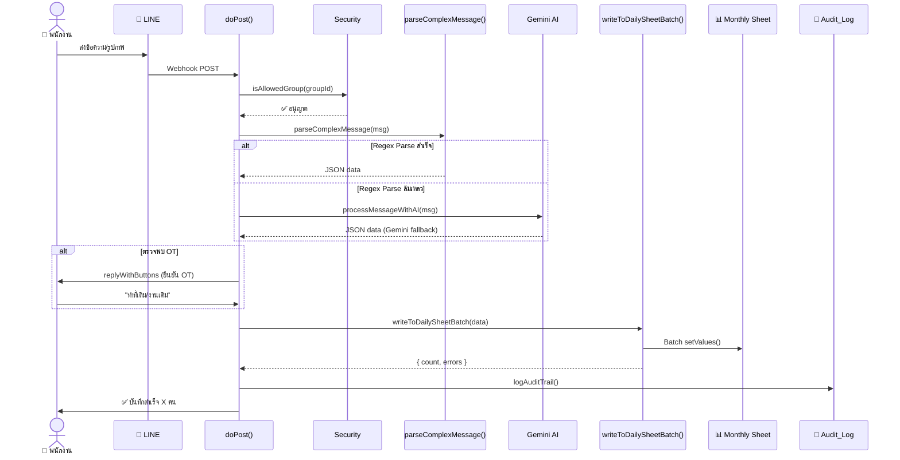
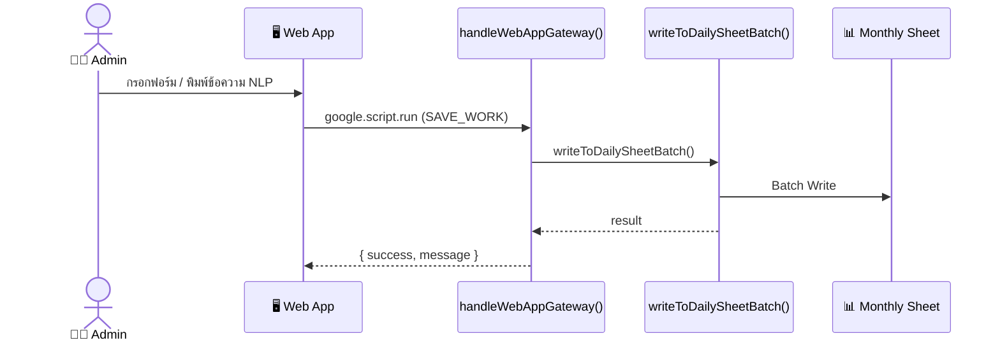

# 📋 คู่มือระบบ & แผนกู้คืนฉุกเฉิน — 52-Islands Smart Worksite System

> **วันที่สแกน:** 16 มิถุนายน 2569  
> **เวอร์ชัน:** V.6 (Build V11 DevOps)  
> **Platform:** Google Apps Script (V8 Runtime)  
> **Script ID:** `1S6nJZeKKBfFOpHZB0x2vqhM47-3ynC6wIY0Gsl0-UFPnmj9aHgXNltoL`

---

## 1. 🏗️ ภาพรวมสถาปัตยกรรมระบบ (System Architecture)



---

## 2. 📂 แผนผังไฟล์ทั้งหมด (File Inventory)

| # | ไฟล์ | ขนาด | หน้าที่หลัก | ระดับความสำคัญ |
|---|------|------|------------|---------------|
| 1 | [Config.gs](file:///c:/Users/Administrator/Documents/GitHub/52-ISlands/Config.gs) | 8.2 KB | ศูนย์กลาง Config, API Keys, Monthly File IDs, Admin IDs | 🔴 Critical |
| 2 | [0_Security.gs](file:///c:/Users/Administrator/Documents/GitHub/52-ISlands/0_Security.gs) | 10.9 KB | Group Whitelist, Employee List, Accommodation, DevOps Merge | 🟡 High |
| 3 | [1_bot line.gs](file:///c:/Users/Administrator/Documents/GitHub/52-ISlands/1_bot%20line.gs) | 36.4 KB | `doPost()`, LINE Webhook handler, Clock-in flow, OT flow | 🔴 Critical |
| 4 | [2_WebApp.gs](file:///c:/Users/Administrator/Documents/GitHub/52-ISlands/2_WebApp.gs) | 9.5 KB | `doGet()`, `saveDailyReport()`, Google Chat integration | 🟡 High |
| 5 | [3_SharedFunctions.gs](file:///c:/Users/Administrator/Documents/GitHub/52-ISlands/3_SharedFunctions.gs) | 40.2 KB | AI calls, Fuzzy Logic, Regex parser, Write to sheet, Audit Trail, Dashboard UI | 🔴 Critical |
| 6 | [4_CoreDatabase.gs](file:///c:/Users/Administrator/Documents/GitHub/52-ISlands/4_CoreDatabase.gs) | 5.7 KB | `writeToDailySheetBatch()`, Batch OT calculation | 🔴 Critical |
| 7 | [5_SupportMisc.gs](file:///c:/Users/Administrator/Documents/GitHub/52-ISlands/5_SupportMisc.gs) | 12.6 KB | Admin notification, Fuzzy suggestions, Employee extraction, Format response | 🟡 High |
| 8 | [6_fuzzy_helpers.gs](file:///c:/Users/Administrator/Documents/GitHub/52-ISlands/6_fuzzy_helpers.gs) | 3.1 KB | `findBestMatch()`, `matchWithMasterList()` | 🟢 Medium |
| 9 | [7 _AI_Assistant.gs](file:///c:/Users/Administrator/Documents/GitHub/52-ISlands/7%20_AI_Assistant.gs) | 23.8 KB | AI Chat processing, Dynamic Logic (5-history rollback), `callGemini()`, DevOps CLI | 🔴 Critical |
| 10 | [8_WorkflowInteractions.gs](file:///c:/Users/Administrator/Documents/GitHub/52-ISlands/8_WorkflowInteractions.gs) | 5.5 KB | Report generation, Changelog, Version calculation | 🟡 High |
| 11 | [9_System_Chat.gs](file:///c:/Users/Administrator/Documents/GitHub/52-ISlands/9_System_Chat.gs) | 15.0 KB | Google Chat App, System commands, Recovery triggers, Threshold management | 🟡 High |
| 12 | [10_DevOps_Core.gs](file:///c:/Users/Administrator/Documents/GitHub/52-ISlands/10_DevOps_Core.gs) | 22.1 KB | DevOps workspace, API Sync, Code injector, Duplicate highlighter | 🟢 Medium |
| 13 | [WebApp_GeminiTools.gs](file:///c:/Users/Administrator/Documents/GitHub/52-ISlands/WebApp_GeminiTools.gs) | 20.9 KB | Web App AI Gateway, 6 AI Tools, Admin Tools, NLP Timelog | 🟡 High |
| 14 | [Script properties.js](file:///c:/Users/Administrator/Documents/GitHub/52-ISlands/Script%20properties.js) | 2.3 KB | Initial setup script for Script Properties | 🟡 High |
| 15 | [index.html](file:///c:/Users/Administrator/Documents/GitHub/52-ISlands/index.html) | 26.9 KB | Web App frontend (PWA) | 🟡 High |
| 16 | [SmartWorksiteDashboard.html](file:///c:/Users/Administrator/Documents/GitHub/52-ISlands/SmartWorksiteDashboard.html) | 117.8 KB | Full Dashboard UI (React-based) | 🟡 High |
| 17 | [Interactive_Manual.html](file:///c:/Users/Administrator/Documents/GitHub/52-ISlands/Interactive_Manual.html) | 16.6 KB | Interactive user manual | 🟢 Medium |
| 18 | [InjectorSidebar.html](file:///c:/Users/Administrator/Documents/GitHub/52-ISlands/InjectorSidebar.html) | 4.4 KB | DevOps code injector sidebar | 🟢 Medium |
| 19 | [appsscript.json](file:///c:/Users/Administrator/Documents/GitHub/52-ISlands/appsscript.json) | 1.5 KB | Manifest: scopes, services, webapp config | 🔴 Critical |

---

## 3. 🔗 แผนผัง Dependencies ระหว่างโมดูล



---

## 4. 🗃️ External Resources & IDs ที่ระบบพึ่งพา

### 4.1 Google Spreadsheets (ฐานข้อมูลหลัก)

| ชื่อ | Sheet ID | หน้าที่ |
|------|----------|---------|
| **ฐานข้อมูลพนักงาน (External DB)** | `1SSbgN9lmObsAyrqjykFttqNbCVDd3yhUq47yT8Z_Agk` | รายชื่อ, รหัส, ที่พัก, Admin emails |
| **ม.ค.** | `1gmS6ZYD4xeO2PP7gu15yvApLaKuFa5tPrmDe-PtMOBk` | ข้อมูลรายวันเดือน 1 |
| **ก.พ.** | `1Uly9KQFnQ5pQyDn9pHGbgelCmXgDLO4DRM846Vsr7EM` | ข้อมูลรายวันเดือน 2 |
| **มี.ค.** | `1wwwbwFyDyoyZOQ_kkfvyrshfpGgi6wCRaPAHU3yXKbE` | ข้อมูลรายวันเดือน 3 |
| **เม.ย.** | `1L4cB7dWgkgejhMV84-RuW7LdDNT9vZwm5I06xa9vQEE` | ข้อมูลรายวันเดือน 4 |
| **พ.ค.** | `1mc7eMzYDZqsUwKr8FZCEKClQZfqIybf6aZ-2mgkWGHI` | ข้อมูลรายวันเดือน 5 |
| **มิ.ย.** | `1kX-D_ehfo01rdj3WLLAvDxPO1IEy-XG5GLWe9i1CSo4` | ข้อมูลรายวันเดือน 6 |
| **ก.ค.** | `13GbWmUNrkLcJmo9gAnVSNnD_tH-PFaULH4I2C1DJEFE` | ข้อมูลรายวันเดือน 7 |
| **ส.ค.** | `1mHSW_osT7LaXZPyU3KjU4i9801eJSibYyu3iHagK2I8` | ข้อมูลรายวันเดือน 8 |
| **ก.ย.** | `1NoNXMDNvMdw5NIfS3QXIi57fCbpqu-iS-6bZQ8dyUBY` | ข้อมูลรายวันเดือน 9 |
| **ต.ค.** | `14SDdBPxt-_muIvtHAx06b2Feh97Q-JkpaDvqlyei1ak` | ข้อมูลรายวันเดือน 10 |
| **พ.ย.** | `1_DxUo7S7m1FwlPIyjHdetGONwdNwO9Ud54Xtmk4di1c` | ข้อมูลรายวันเดือน 11 |
| **ธ.ค.** | `1O5_8zTLQWZKuv647H65K-SHVyY3H2fDmwoWtZNUB7ZU` | ข้อมูลรายวันเดือน 12 |

### 4.2 API Keys & Tokens

| Key | ใช้ใน | หมายเหตุ |
|-----|-------|---------|
| `LINE_CHANNEL_ACCESS_TOKEN` | LINE Bot | ⚠️ เก็บใน GLOBAL_CONFIG + Script Properties |
| `GEMINI_API_KEY_LINE` | LINE Bot AI | API Key ตัวที่ 1 |
| `GEMINI_API_KEY_WEB` | Web App AI | API Key ตัวที่ 2 (แยกคนละตัว) |

### 4.3 Google Services ที่เปิดใช้งาน (จาก appsscript.json)

| Service | Version | ใช้ทำอะไร |
|---------|---------|----------|
| Drive API | v2 | จัดการไฟล์ใน Drive |
| Sheets API | v4 | อ่าน/เขียน Spreadsheets |
| Admin Directory | directory_v1 | ดึงข้อมูลพนักงาน Workspace |
| Google Chat | v1 | ส่งข้อความ Chat |
| Groups Settings | v1 | จัดการกลุ่ม |
| People API | v1 | ข้อมูลติดต่อ |
| Vertex AI | v1 | AI Platform (สำรอง) |

### 4.4 OAuth Scopes ที่จำเป็น

```
script.projects, script.external_request, spreadsheets,
drive, userinfo.email, script.container.ui
```

---

## 5. 📊 การไหลของข้อมูล (Data Flow)

### 5.1 Flow: ลงเวลาผ่าน LINE Bot (หลัก)



### 5.2 Flow: ลงเวลาผ่าน Web Dashboard



---

## 6. ⚠️ จุดเสี่ยงและจุดอ่อนของระบบ (Risk Analysis)

### 🔴 ความเสี่ยงสูง (Critical)

| # | จุดเสี่ยง | รายละเอียด | ผลกระทบ |
|---|----------|-----------|---------|
| 1 | **API Keys ฝังใน Source Code** | LINE Token, Gemini Keys อยู่ใน [Config.gs](file:///c:/Users/Administrator/Documents/GitHub/52-ISlands/Config.gs) ตรงๆ | หาก repo รั่ว = ถูก compromise ทั้งระบบ |
| 2 | **ฟังก์ชันชื่อซ้ำ (Duplicate Functions)** | `isAdmin()` ซ้ำใน Config.gs (L38) + 1_bot line.gs (L596), `getDynamicConfig()` ซ้ำใน Config.gs (L48) + 3_SharedFunctions.gs (L446), `doGet()` ซ้ำใน 2_WebApp.gs + WebApp_GeminiTools.gs, `checkIsAdmin()` ซ้ำใน 3_SharedFunctions.gs + 7_AI_Assistant.gs, `getDynamicPrompt()` ซ้ำใน 3_SharedFunctions.gs + 7_AI_Assistant.gs | GAS ใช้ "last wins" — ฟังก์ชันตัวสุดท้ายจะ override ตัวก่อนหน้า ทำให้ลอจิกอาจผิดพลาด |
| 3 | **CORE_DB ประกาศซ้ำ** | ประกาศ `var CORE_DB = {...}` ทั้งใน [2_WebApp.gs](file:///c:/Users/Administrator/Documents/GitHub/52-ISlands/2_WebApp.gs) (L1) และ [4_CoreDatabase.gs](file:///c:/Users/Administrator/Documents/GitHub/52-ISlands/4_CoreDatabase.gs) (L5) | อาจมี Race Condition ค่าคอลัมน์ผิด |
| 4 | **Lock Timeout เพียง 30 วินาที** | `lock.waitLock(30000)` อาจไม่เพียงพอเมื่อมีคนลงเวลาพร้อมกันจำนวนมาก | ข้อมูลอาจสูญหายในช่วง Rush Hour |
| 5 | **Monthly File IDs Hardcoded** | อาร์เรย์ `MONTHLY_FILE_IDS` + `backupIds` ซ้ำ 2 ที่ | หากเปลี่ยนไฟล์ต้องแก้ทั้ง 2 จุด |

### 🟡 ความเสี่ยงปานกลาง (Warning)

| # | จุดเสี่ยง | รายละเอียด |
|---|----------|-----------|
| 6 | Cache TTL ไม่สอดคล้อง | Config.gs ใช้ 1 ชม. (3600s), 3_SharedFunctions.gs ใช้ 6 ชม. (21600s) |
| 7 | `async/await` ใน GAS | หลายฟังก์ชันใช้ `async` ซึ่ง GAS รองรับไม่เต็มที่ — อาจทำให้ Error ซ่อนตัว |
| 8 | Syntax Error ใน Config.gs L40 | มีข้อความ `EXTERNAL_DATABASE_ID` ลอยอยู่ปลายบรรทัดโดยไม่มี semicolon |
| 9 | `ADMIN_LINE_IDS` vs `ADMIN_LINE_ID` | ใช้สลับไปมาหลายที่ ทำให้ดึง Admin IDs ไม่ตรงกัน |
| 10 | ไม่มี Rate Limiting | Gemini API และ LINE API ไม่มีระบบจำกัด Request — อาจถูก Throttle |

---

## 7. 🚨 แผนกู้คืนระบบฉุกเฉิน (Emergency Recovery Plan)

### 📋 Scenario Matrix

| Scenario | ระดับ | เวลากู้คืน | ดูขั้นตอน |
|----------|-------|-----------|----------|
| A. LINE Bot หยุดตอบ | 🔴 Critical | 5-15 นาที | §7.1 |
| B. Web App ล่ม / เปิดไม่ได้ | 🔴 Critical | 5-10 นาที | §7.2 |
| C. ข้อมูลลงเวลาผิด/หาย | 🟡 High | 10-30 นาที | §7.3 |
| D. API Key หมดอายุ/รั่ว | 🔴 Critical | 15-30 นาที | §7.4 |
| E. Sheet เดือนเปิดไม่ได้ | 🟡 High | 5-15 นาที | §7.5 |
| F. Logic ระบบเพี้ยน (Config ผิด) | 🟡 High | 2-5 นาที | §7.6 |
| G. Gemini AI ไม่ตอบ | 🟢 Medium | 0 นาที (auto-fallback) | §7.7 |
| H. ระบบ Lock ค้าง | 🔴 Critical | 1-5 นาที | §7.8 |
| I. ต้องกู้คืนทั้งระบบจากศูนย์ | 🔴 Disaster | 30-60 นาที | §7.9 |

---

### 7.1 🔴 Scenario A: LINE Bot หยุดตอบ

**อาการ:** พนักงานส่งข้อความ/รูปแต่บอทไม่ตอบ

**ขั้นตอนกู้คืน:**

1. **ตรวจสอบ Deployment**
   - ไปที่ [Apps Script Editor](https://script.google.com/d/1S6nJZeKKBfFOpHZB0x2vqhM47-3ynC6wIY0Gsl0-UFPnmj9aHgXNltoL/edit)
   - คลิก **Deploy → Manage deployments**
   - ตรวจว่า Web App deployment ยังเปิดอยู่

2. **ตรวจ Webhook URL**
   - ไปที่ [LINE Developers Console](https://developers.line.biz/)
   - เช็คว่า Webhook URL ตรงกับ Deployment URL ล่าสุด
   - กด **Verify** เพื่อทดสอบ

3. **ตรวจ Error Log**
   - เปิด Apps Script Editor → **Executions** (ซ้ายล่าง)
   - หาข้อผิดพลาดล่าสุดของ `doPost`

4. **ตรวจ SYSTEM_STATUS**
   - อาจถูกปิดระบบด้วยคำสั่ง `ปิดระบบ` — ตรวจใน Script Properties
   - แก้: ตั้งค่า `SYSTEM_STATUS` = `ON`

5. **Deploy ใหม่ (กรณีร้ายแรง)**
   ```
   Deploy → New deployment → Web App
   - Execute as: Me
   - Who has access: Anyone
   → Copy URL ใหม่ไปใส่ LINE Webhook
   ```

> [!CAUTION]
> การ Deploy ใหม่จะเปลี่ยน URL — ต้องอัปเดต Webhook URL ที่ LINE Developers Console ด้วยทุกครั้ง

---

### 7.2 🔴 Scenario B: Web App ล่ม

**อาการ:** เปิดเว็บ Dashboard แล้วขึ้นหน้าว่างหรือ Error

**ขั้นตอนกู้คืน:**

1. **ตรวจ doGet() ว่าถูกตัว**
   - ระบบมี `doGet()` **ซ้ำ 2 ที่**: [2_WebApp.gs](file:///c:/Users/Administrator/Documents/GitHub/52-ISlands/2_WebApp.gs) (L141) และ [WebApp_GeminiTools.gs](file:///c:/Users/Administrator/Documents/GitHub/52-ISlands/WebApp_GeminiTools.gs) (L21)
   - GAS จะใช้ตัวที่ **โหลดสุดท้าย** — ตรวจลำดับไฟล์ใน Editor

2. **ตรวจ HTML ที่ serve**
   - `doGet` ใน WebApp_GeminiTools.gs serve `index.html` พร้อม inject config
   - ตรวจว่า `index.html` ยังอยู่ครบ

3. **ตรวจ Error ใน Execution log**

4. **Fallback**: Deploy ใหม่แบบ `HtmlService.createHtmlOutputFromFile('index')`

---

### 7.3 🟡 Scenario C: ข้อมูลลงเวลาผิด/หาย

**ขั้นตอนกู้คืน:**

1. **ยกเลิกรายการล่าสุด (ผ่าน LINE)**
   - พิมพ์: `ยกเลิกรายการล่าสุด` หรือ `ยกเลิกล่าสุด`
   - ระบบจะดึงจาก `LAST_ENTRY_${userId}` ใน Script Properties

2. **ยกเลิกเฉพาะคน (ผ่าน LINE)**
   - พิมพ์: `ยกเลิก [ชื่อ] [วันที่ dd/mm/yy]`
   - ระบบเรียก `undoLastEntry()` ล้างคอลัมน์ 6-17

3. **แก้ไขด้วยมือใน Google Sheets**
   - เปิด Monthly Sheet ของเดือนนั้น
   - ไปที่ Tab ชื่อวันที่ (เช่น "16 มิถุนายน 2569")
   - แก้ไขข้อมูลโดยตรง

4. **ตรวจ Audit Log**
   - เปิด External DB → Sheet `Audit_Log`
   - ค้นหา timestamp ที่ต้องการ เพื่อดูข้อมูลก่อนแก้ไข

---

### 7.4 🔴 Scenario D: API Key หมดอายุ/รั่ว

**ขั้นตอนกู้คืน:**

1. **LINE Token**
   - ไป LINE Developers Console → Channel → **Messaging API** → **Issue** token ใหม่
   - อัปเดตใน Script Properties: `LINE_CHANNEL_ACCESS_TOKEN`

2. **Gemini API Key**
   - ไป [Google AI Studio](https://aistudio.google.com/apikey) → สร้าง Key ใหม่
   - อัปเดต **ทั้ง 2 ที่**:
     - Script Properties: `GEMINI_API_KEY_LINE` + `GEMINI_API_KEY_WEB`
     - [Config.gs](file:///c:/Users/Administrator/Documents/GitHub/52-ISlands/Config.gs): ค่าใน `GLOBAL_CONFIG` (L10-11)

3. **Revoke Key เก่า**
   - ลบ Key ที่รั่วทันทีจาก Google Cloud Console / LINE Console

> [!WARNING]
> Config.gs มี API Keys ฝังอยู่ใน source code (L9-11) — หากแก้ใน Script Properties อย่างเดียวจะไม่พอ เพราะ `GLOBAL_CONFIG` ถูกใช้เป็น fallback

---

### 7.5 🟡 Scenario E: Sheet เดือนเปิดไม่ได้

**ขั้นตอนกู้คืน:**

1. **ตรวจสิทธิ์ Sharing**
   - เปิด Google Drive → ค้นหา Sheet ID ของเดือนนั้น
   - ตรวจว่า Service Account / Owner ยังมีสิทธิ์ Editor

2. **สร้าง Sheet ใหม่**
   - สร้าง Google Spreadsheet ใหม่
   - สร้าง Tab ตามรูปแบบวันที่ไทย (เช่น "1 มิถุนายน 2569")
   - ใส่หัวตาราง + รายชื่อพนักงานจาก External DB
   - อัปเดต ID ใน `MONTHLY_FILE_IDS` ทั้ง **2 จุด**:
     - [Config.gs](file:///c:/Users/Administrator/Documents/GitHub/52-ISlands/Config.gs) L94-107
     - [3_SharedFunctions.gs](file:///c:/Users/Administrator/Documents/GitHub/52-ISlands/3_SharedFunctions.gs) L341-348 (`backupIds`)

---

### 7.6 🟡 Scenario F: Logic ระบบเพี้ยน (Config ผิด)

**ขั้นตอนกู้คืน:**

1. **ผ่าน LINE ChatOps (Admin)**
   - พิมพ์: `กู้คืนระบบ` หรือ `กู้คืนระบบ 2` (ย้อน 2 ขั้น)
   - ระบบเรียก `rollbackLogic()` กู้คืนจาก Logic History (เก็บสูงสุด 5 ชั้น)

2. **ผ่าน Script Properties โดยตรง**
   - เปิด Apps Script Editor → **Project Settings** → **Script Properties**
   - แก้ค่า `DYNAMIC_SYSTEM_LOGIC` เป็น JSON เดิม
   - ลบ Cache: ไม่มีวิธีลบจาก UI — ต้องรอ Cache หมดอายุ (1-6 ชม.)

3. **รีเซ็ต Config ทั้งหมด**
   - รัน `INITIAL_SETUP_PROPERTIES()` จาก [Script properties.js](file:///c:/Users/Administrator/Documents/GitHub/52-ISlands/Script%20properties.js)
   - จะ overwrite Script Properties ทั้งหมดกลับเป็นค่าตั้งต้น

---

### 7.7 🟢 Scenario G: Gemini AI ไม่ตอบ

**ระบบมี Auto-Fallback:**
- `fetchWithRetry()` จะลอง 3 ครั้งพร้อม exponential backoff (500ms, 1s, 2s)
- หาก AI parse ล้มเหลว → ระบบใช้ `parseComplexMessage()` (Regex) แทน
- ไม่ต้องกู้คืนด้วยมือ — แค่แจ้งพนักงานว่าระบบรับเฉพาะรูปแบบมาตรฐาน

---

### 7.8 🔴 Scenario H: ระบบ Lock ค้าง

**อาการ:** ทุกข้อความได้รับ "⚠️ ระบบกำลังประมวลผลคิวอื่นอยู่"

**ขั้นตอนกู้คืน:**

1. **รอ Lock หมดอายุ** — GAS Lock มีอายุสูงสุด 6 นาที
2. **Deploy ใหม่** — จะ reset runtime environment ใหม่ทั้งหมด
3. **ตรวจ DevOps** — รัน `system-scan` ผ่าน `runDevOpsCliCommand("system-scan")` เพื่อตรวจสถานะ Lock

---

### 7.9 🔴 Scenario I: กู้คืนทั้งระบบจากศูนย์ (Disaster Recovery)

**เงื่อนไข:** ระบบพังจนไม่สามารถเข้าถึง Apps Script ได้ หรือต้องสร้างใหม่ทั้งหมด

**ขั้นตอน:**

```
📋 Disaster Recovery Checklist
═══════════════════════════════

Phase 1: สร้าง Apps Script Project ใหม่ (10 นาที)
─────────────────────────────────────────────────
☐ 1.1 สร้าง Google Apps Script Project ใหม่
☐ 1.2 Copy ไฟล์ทั้งหมดจาก GitHub repo (52-ISlands)
    - .gs files x 12
    - .html files x 4  
    - appsscript.json x 1
☐ 1.3 ตรวจ appsscript.json ว่ามี Advanced Services ครบ

Phase 2: ตั้งค่า Config (10 นาที)
─────────────────────────────────
☐ 2.1 รัน INITIAL_SETUP_PROPERTIES() เพื่อตั้งค่า Script Properties
☐ 2.2 ตรวจสอบ EXTERNAL_DATABASE_ID ว่ายังเข้าถึงได้
☐ 2.3 ตรวจสอบ MONTHLY_FILE_IDS ว่ามีไฟล์ครบ 12 เดือน
☐ 2.4 ตรวจสอบ DRIVE_FOLDER_ID สำหรับเก็บรายงาน
☐ 2.5 อัปเดต API Keys (สร้างใหม่ถ้าจำเป็น):
    - LINE_CHANNEL_ACCESS_TOKEN
    - GEMINI_API_KEY_LINE
    - GEMINI_API_KEY_WEB
☐ 2.6 ตั้งค่า ADMIN_LINE_IDS (LINE User IDs ของ Admin)

Phase 3: Deploy & Connect (10 นาที)
────────────────────────────────────
☐ 3.1 Deploy Web App:
    - Execute as: User deploying the web app
    - Who has access: Anyone (even anonymous)
☐ 3.2 Copy Deployment URL
☐ 3.3 ไปที่ LINE Developers Console:
    - Channel → Messaging API → Webhook URL → ใส่ URL ใหม่
    - กด Verify → ต้องได้ "Success"
    - เปิด "Use webhook" = ON
☐ 3.4 ตั้งค่า Google Chat (ถ้าใช้):
    - ไปที่ GCP Console → Chat API → Configuration
    - ตั้ง App URL ใหม่

Phase 4: Enable Advanced Services (5 นาที)
───────────────────────────────────────────
☐ 4.1 เปิด Editor → Resources → Advanced Google services
☐ 4.2 เปิด: Drive API, Sheets API, Admin SDK, Chat API, 
         Groups Settings API, People API, Vertex AI
☐ 4.3 ตรวจว่า GCP Project เชื่อมต่อกันถูกต้อง

Phase 5: ทดสอบระบบ (10 นาที)
─────────────────────────────
☐ 5.1 ส่งข้อความทดสอบใน LINE Group
☐ 5.2 เปิด Web App ดูว่า Dashboard ขึ้น
☐ 5.3 ตรวจ Audit_Log ว่ามีการบันทึก
☐ 5.4 ทดสอบคำสั่ง Admin: "สถานะระบบ"
☐ 5.5 ทดสอบลงเวลา 1 คน → ตรวจ Monthly Sheet

Phase 6: Lockdown (5 นาที)
──────────────────────────
☐ 6.1 ตั้งค่า Group Whitelist (ALLOWED_GROUP_IDS)
☐ 6.2 ตั้ง SYSTEM_STATUS = ON
☐ 6.3 ตั้ง IS_TESTING = FALSE
☐ 6.4 แจ้งทีมว่าระบบพร้อมใช้งาน
```

---

## 8. 🛡️ คำสั่ง Admin สำหรับจัดการฉุกเฉิน (Quick Reference)

### ผ่าน LINE Bot (เฉพาะ Admin)

| คำสั่ง | ผลลัพธ์ |
|--------|---------|
| `เปิดระบบ` | เปิดรับลงเวลา |
| `ปิดระบบ` | ปิดรับลงเวลาชั่วคราว |
| `ทดสอบระบบ` | เปิดโหมดทดสอบ |
| `ปิดโหมดทดสอบ` | ปิดโหมดทดสอบ |
| `สถานะระบบ` | แสดง SYSTEM_STATUS |
| `กู้คืนระบบ` | Rollback logic ย้อน 1 ขั้น |
| `กู้คืนระบบ 3` | Rollback logic ย้อน 3 ขั้น |
| `ตั้งค่า KEY=VALUE` | แก้ไข Config (เช่น `ตั้งค่า FUZZY_THRESHOLD=0.85`) |
| `รายงาน` | สร้างรายงานสรุปและส่ง Google Chat |
| `ยกเลิกรายการล่าสุด` | ยกเลิกการลงเวลาล่าสุด |

### ผ่าน Google Chat App

| คำสั่ง | ผลลัพธ์ |
|--------|---------|
| `รายงาน` | สร้างรายงานสรุป |
| `วิธีใช้` | แสดงเมนูคำสั่ง |
| `กู้คืนบอทแอพ` | Trigger recovery สำหรับ WebApp |
| `กู้คืนบอทไลน์` | Trigger recovery สำหรับ LineBot |
| `กู้คืนสมองกลาง` | Trigger recovery สำหรับ CoreBrain |

### ผ่าน Google Sheets (เมนู DevOps)

| เมนู | ผลลัพธ์ |
|------|---------|
| ⚙️ Initialize | สร้างโครงสร้าง DevOps Workspace |
| 🔄 Auto API Sync | ดึงโค้ดจาก GAS ลงตาราง |
| 👁️ Toggle Outline | ยุบ/กางโค้ด |
| 📝 Changelog | บันทึกการอัปเดต |
| 📝 ตรวจฟังก์ชันซ้ำ | สแกนและไฮไลต์ซ้ำซ้อน |
| 📝 อัปเดตโค้ด | เปิด Sidebar injector |

---

## 9. 🔧 การบำรุงรักษาเชิงป้องกัน (Preventive Maintenance)

### รายวัน
- [ ] ตรวจ Execution Log ใน Apps Script Editor → ไม่ควรมี Error
- [ ] ตรวจ Audit_Log sheet → ข้อมูลบันทึกสม่ำเสมอ

### รายสัปดาห์
- [ ] ตรวจขนาด Audit_Log → ลบแถวเก่าเกิน 10,000 แถว
- [ ] ตรวจสิทธิ์ Monthly Sheets → ยังเข้าถึงได้ทุกเดือน

### รายเดือน (ก่อนขึ้นเดือนใหม่)
- [ ] ตรวจ Monthly Sheet เดือนถัดไปว่ามี Tab วันที่ครบ 28-31 วัน
- [ ] ตรวจรายชื่อพนักงานใน External DB ว่าเป็นปัจจุบัน
- [ ] สำรองข้อมูล Script Properties (Export เป็น JSON)

### รายปี (ธันวาคม)
- [ ] สร้าง Monthly Sheet ใหม่ 12 ไฟล์สำหรับปีถัดไป
- [ ] อัปเดต `MONTHLY_FILE_IDS` ทั้ง 2 จุด
- [ ] ตรวจ LINE Token ว่ายังใช้ได้
- [ ] ตรวจ Gemini API quota

---

## 10. 📞 ข้อมูลติดต่อฉุกเฉิน

| ระบบ | Console/URL |
|------|-------------|
| Apps Script Editor | `https://script.google.com/d/1S6nJZeKKBfFOpHZB0x2vqhM47-3ynC6wIY0Gsl0-UFPnmj9aHgXNltoL/edit` |
| LINE Developers | `https://developers.line.biz/` |
| Google AI Studio | `https://aistudio.google.com/apikey` |
| GCP Console | `https://console.cloud.google.com/` |
| GitHub Repo | `c:\Users\Administrator\Documents\GitHub\52-ISlands` |

---

> [!IMPORTANT]
> เอกสารนี้ควรถูก **อัปเดตทุกครั้ง** ที่มีการเพิ่มไฟล์, เปลี่ยน API Key, หรือเปลี่ยน Sheet ID — เพื่อให้แผนกู้คืนใช้งานได้จริงในกรณีฉุกเฉิน
